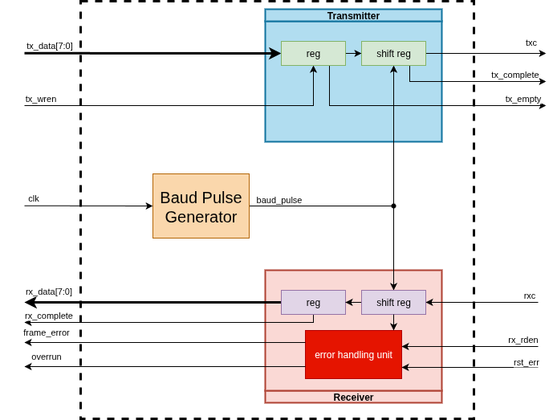

# RTL часть


## Параметры

Модуль работает на частоте, задаваемой входным `clk`. Скорость приема/передачи данных по умолчанию равна **115200** бод. При изменении входной частоты (по умолчанию **100** МГц) и/или изменении скорости приема/передатчика необходимо изменить параметры внутри модуля: `CLK_FREQ`, `BAUD_RATE`.

Синхронизация приема/передачи данных со скоростью работы модуля осуществляется с помощью счетчика `baud_cnt`. Инкрементирование происходит на каждом такте `clk`. При достижении счетчиком значения `BIT_PERIOD-1` формируется импульс `baud_tick`, длительностью 1 такт клока.

```
always_ff @(posedge clk) begin
    baud_cnt  <= baud_cnt + 1;
    baud_tick <= 0;
    if (baud_cnt == BIT_PERIOD - 1) begin
        baud_cnt  <= 0;
        baud_tick <= 1;
    end
end
```

## Передатчик

Передатчик реализован с помощью конечного автомата с следующими состояниями:

| Название      | Описание      |
|---------------|---------------|
| TX_IDLE       | Ожидание данных
| TX_START      | Формирование стартого бита на шине txc
| TX_DATA       | Передача данных (8 бит) с помощью сдвигового регистра, начиная с младшего (LSB)
| TX_STOP       | Формирование стопового бита

Захват данных с шины `tx_data` в буфер осуществляется по прибытии сигнала `tx_wren`, после чего опускается флаг `tx_empty` до тех пор, пока не будет считаны данные из буфера (состояние `TX_IDLE` или `TX_START`). Если по достижении состояния `TX_STOP` в буфере уже будут новые данные (`tx_empty = 0`), состояние сразу переходит в `TX_START`, минуя `TX_IDLE`. Если данные переданы, а новые не поступили, то в состоянии `TX_STOP` формируется флаг `tx_complete`, сигнализируя об окончании передачи.

## Приемним

Применик так же реализован с помощью конечного автомата:

| Название      | Описание      |
|---------------|---------------|
| RX_IDLE       | Ожидание стартового бита на шине rxc
| RX_HALF       | Ожидание середины стартового бита для проверки
| RX_DATA       | Прием 8-битного слова в сдвиговый регистр
| RX_STOP       | Проверка стопового бита, проверка на прочтение предыдущих данных

Для отслеживания состояния шины приемника `rxc` используется синхронный сдвиговый регистр `rxc_shift[3]`, сдвиг происходит каждый такт `clk`.

```
always_ff @(posedge clk) begin
    rxc_shift[0] <= rxc;
    rxc_shift[1] <= rxc_shift[0];
    rxc_shift[2] <= rxc_shift[1];
end

always_comb start_detected = (rxc_shift[2] && (!rxc_shift[1]));    // Catch the START bit
```

Обнаружение стартового бита на шине `rxc` происходит, когда сигнал `start_detect` переходит в состояние *лог.1*, позволяя перейти состоянию КА из `RX_IDLE` в `RX_HALF`.

Состояние `RX_HALF` служит дополнительной проверкой наличия стартового бита на шине `rxc`: если при достижении середины бита `rxc` все еще в *лог.0*, то состояние переходит `в RX_DATA`, иначе возвращается в `RX_IDLE`.

В состоянии `RX_DATA` данные записываются в сдвиговый регистр, после состояние переход в `RX_STOP`. После завершения 8-битного слова происходит проверка стопового бита, после чего поднимается флаг `rx_complete`, сигнализируя об окончании чтения, а данные из сдвигового регистра передаются на шину `rx_data`.

Если стоповый бит некорректный (`rxc = 0`), поднимается флаг `frame_error`.

Сброс флага `rx_complete` осуществляется подачей сигнала `rx_rden`, сигнализируя о прочтении данных из шины `rx_data`.

Если в момент передачи данных из сдвигового регистра на шину `rx_data` флаг `rx_complete` все еще находится в *лог.1* (данные не прочитаны), поднимается флаг `overrun`.

Сброс флагов ошибки происходит с помощью сигнала `rst_err`, длительность которого составялет 1 такт `clk`.

{: style="height:250px" }
