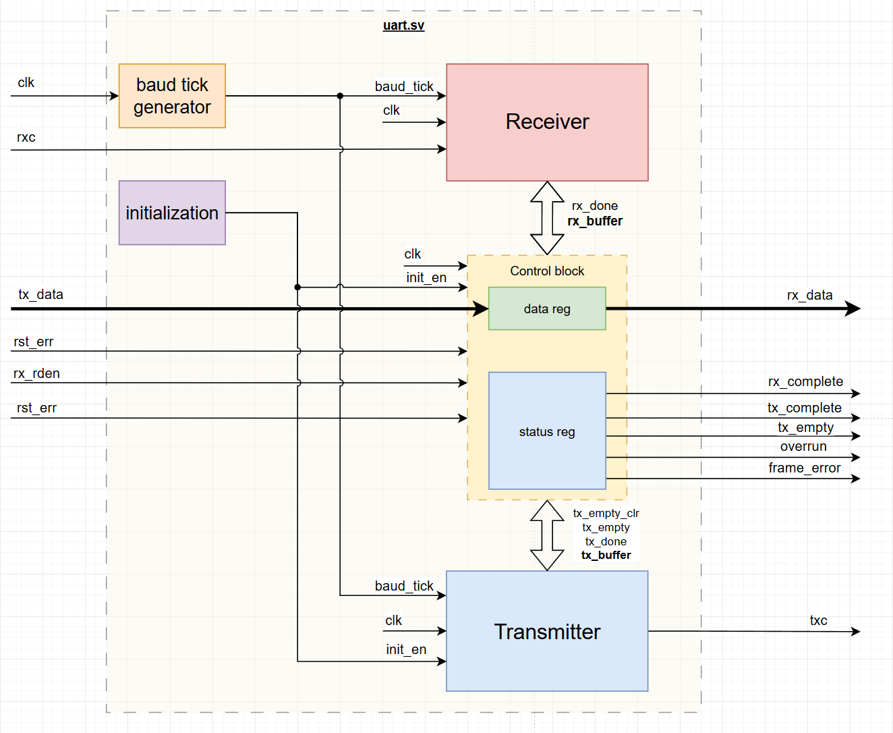
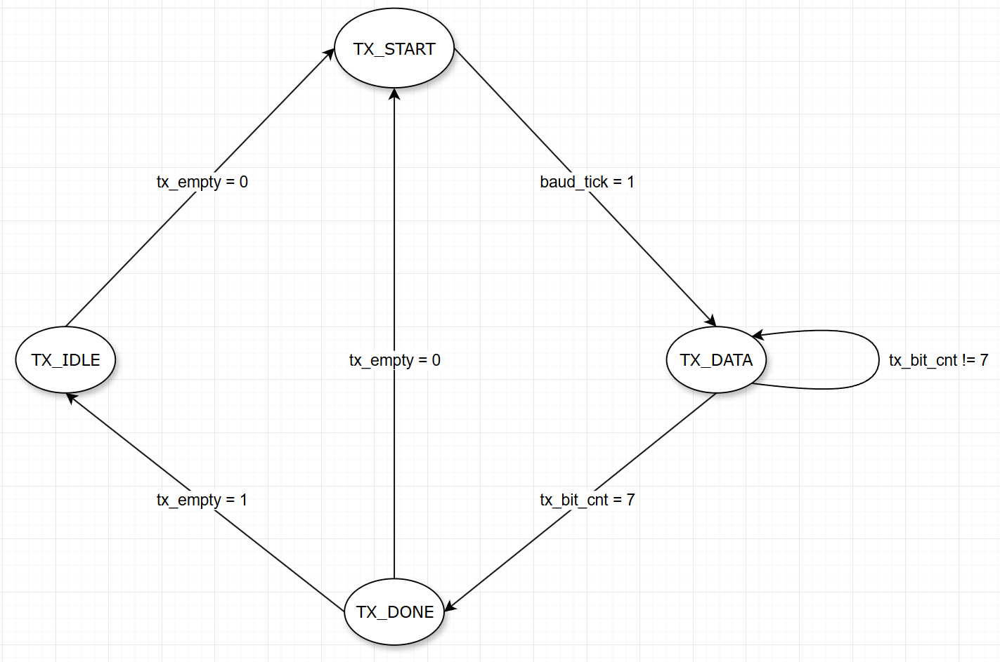
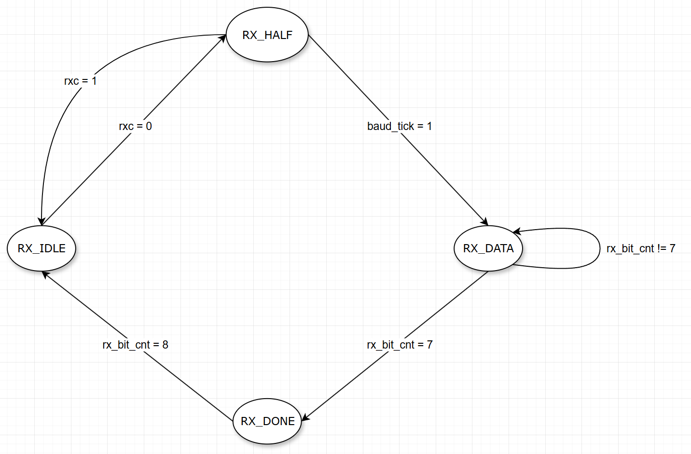
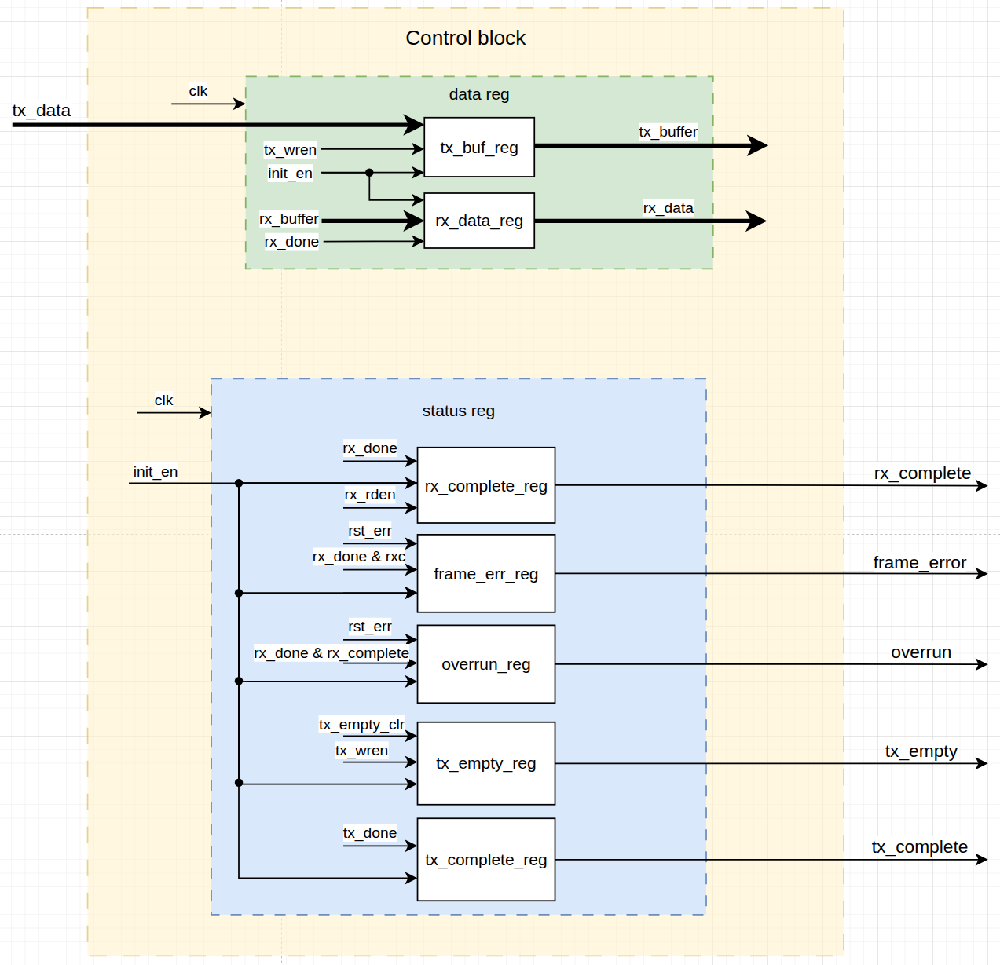

# RTL часть

Иерархия hard части проекта:

```
/src
  |
  |--/<...>
  |
  |--/syn
       |
       |--/uart_tx(отдельный проект, содержащий только часть передатчика)
       |     |
       |     |--(...)
       |
       |--/uart_rx(отдельный проект, содержащий только часть приемника)
       |     |
       |     |--(...)
       |
       |--/uart(полноценный проект UART [RX+TX])
             |
             |--uart.sv (main module)
             |
             |--uart_tx.sv (TX part)
             |
             |--uart_rx.sv (RX part)
             |
             |--uart_if.sv (файл интерфейса [декларация сигналов для RTL и testbench])
             |
             |--params_pkg.sv (package с параметрами)
             |
             |--top.sv (вспомогательный модуль для верификации [исполняет функцию top модуля])
```

Разбиение проекта на различные директории (uart / uart_tx / uart_rx) позволяет гибко отладить работоспособность каждой части (RX or TX) или добавить фичу без нужды внесения изменений в общий проект. Отдельные же файлы в директории визуально помогают расчленить проект на составляющие, не загромождая один файл. 

## Интерфейс

Для упрощения написания проекта предложен следующий интерфейс UART:

| Порты        | Направление |  Описание                                  |
|--------------|-------------|--------------------------------------------|
|clk           |    input    | Входной клок                               |
|txc           |    output   | Линия передачи данных передатчика          |
|rxc           |    input    | Линия приема данных передатчика            |
|tx_data [7:0] |    input    | Шина приема данных передатчика             |
|tx_wren       |    input    | Флаг разрешения на передачу                |
|rx_data [7:0] |    output   | Шина передачи данных передатчика           |
|rx_rden       |    input    | Флаг прочтения данных                      |
|tx_empty      |    output   | Флаг заполнения буфера данных передатчика  |   
|tx_complete   |    output   | Флаг завершения передачи данных            |
|rx_complete   |    output   | Флаг завершения приема данных              |
|frame_error   |    output   | Флаг некорректного стоп-бита               |
|overrun       |    output   | Флаг "Новый байт принят до чтения старого" |
|rst_err       |    input    | Сигнал сброса ошибок                       |

Декларация сигналов и портов содержится в файле uart_if.sv. Такой подход позволяет гибко менять интерфейс (хоть и не поощеряется такое занятие) и легко инстанцировать модули в проект. uart_if.sv содержит два модпорта: 1) uart_mp и 2) tb_mp (в этом модпорте направления сигналов инвертированы).

## Параметры

Файл params_pkg.sv содержит основные параметры, такие как: 

* тактовая частота `clk` - **CLK_FREQ**,
* боды (скорость приема/передачи) - **BAUD_RATE**,
* период следования одного бита данных - **BIT_PERIOD**,
* половина периода следования одного бита данных - **HALF_PERIOD**,
* период одного такта `clk` - **CLK_CYCLE**,
* период следования одного бита данных в тактах `clk` - **UART_CYCLE**.

В общем случае UART поддерживает различные скорости приема/передачи данных "baud rate" (от 1200 до 115200 для RS-232). Разработанный модуль имеет встроенный генератор baud rate, генерирующий импульсы с периодом, задаваемым параметром **BIT_PERIOD**. Для корректного расчета этого парметра необходимо указать референсную частоту `clk` **CLK_FREQ**.

Остальные параметры необязательны, служат лишь для упрощения читаемости кода RTL.

## Main Uart модуль 

Файл uart.sv является головным файлом проекта. Декларация портов модуля происходит с помощью модпорта uart_mp интерфейса uart_if.sv. 

Модуль разбит на 5 составляющих:

* Генератор **baud rate**,
* Приемник (Receiver),
* Передатчик (Trasmitter),
* Блок управления (Control block), 
* Схема инициализации.

{: style="height:600px" }

Связь с подмодуля приемника и передатчика происходит с помощью интерфейса со следующими портами:

**Приемник**

| Порт          | Направление | Описание      |
|---------------|-------------|---------------|
| clk           |    output   | Тактовая частота подмодуля
| baud_tick     |    output   | Тактовый сигнал для захвата данных с линии rxc
| rxc           |    output   | Линия приема данных
| rx_done       |    input    | Флаг окончания приема данных
| rx_buffer     |    input    | Буффер данных

**Передатчик**

| Порт          | Направление | Описание      |
|---------------|-------------|---------------|
| clk           |    output   | Тактовая частота подмодуля
| baud_tick     |    output   | Тактовый сигнал для передачи данных на линию txc
| txc           |    input    | Линия передачи данных
| tx_done       |    input    | Флаг окончания передачи данных
| tx_buffer     |    output   | Буффер данных
| tx_empty      |    output   | Флаг "буффер пустой"
| tx_empty_clr  |    input    | Флаг чтения данных из буффера

### Инициализация

Выходные порты `txc`, `rx_data`, `tx_empty`, `tx_complete`, `rx_complete`, `overrun`, `frame_error` должны быть инициализированы перед началом работы модуля UART. Этот процесс реализован с помощью сдвигового регистра. По истечении 3 тактов `clk` модуль считается инициализирован и готовым к работе.

### Baud rate генератор

Синхронизация приема/передачи данных со скоростью работы модуля осуществляется с помощью счетчика `baud_cnt`. Инкрементирование происходит на каждом такте `clk`. При достижении счетчиком значения `BIT_PERIOD-1` формируется импульс `baud_tick`, длительностью 1 такт клока.

По умолчанию частота `clk` = 100 МГц, скорость UART = 115200 бод. Теоритическое значение **BIT_PERIOD**:

$$
\text{BAUD PERIOD}_{teor} = \frac{\text{CLK FREQ}}{\text{BIT RATE}} = 868.055555...
$$

Реальное значение с округлением в меньшую сторону = 868. При таком значении ошибка составляет:

$$
Error = \frac{\text{BAUD PERIOD}_{teor} - \text{BAUD PERIOD}_{real}}{\text{BAUD PERIOD}_{real}} * 100\% = 0.0064\%
$$

## Передатчик

Передатчик реализован с помощью конечного автомата со следующими состояниями:

| Название      | Описание      |
|---------------|---------------|
| TX_IDLE       | Ожидание данных
| TX_START      | Формирование стартого бита на шине txc
| TX_DATA       | Передача данных (8 бит) с помощью сдвигового регистра, начиная с младшего (LSB)
| TX_STOP       | Формирование стопового бита

Перед началом транзакции необходимо послать на шину `tx_data` необходимые данные, после чего послать сигнал `tx_wren`. По приходу этого сигнала заполняется буффер `tx_buffer`, снимая флаг `tx_empty`, что запускает работу автомата (переход **TX_IDLE -> TX_START**).
Данные из буфера передаются в сдвиговый регистр `tx_shift`, обратно взводя флаг `tx_empty` с помощью сигнала сброса `tx_empty_clr`.
Данные передаются от старшего бита к младшему.
После завершения транзакции проверяется флаг `tx_empty`: если флаг опущен, то состояние автомата сразу переходит в **TX_START**. При этом флаг `tx_complete` не взводится.
Когда транзакция завершена, а буффер пуст, поднимается флаг `tx_complete`, длительностью 1 такт `clk`. 

{: style="height:600px" }

## Приемним

Применик так же реализован с помощью конечного автомата:

| Название      | Описание      |
|---------------|---------------|
| RX_IDLE       | Ожидание стартового бита на шине rxc
| RX_HALF       | Ожидание середины стартового бита для проверки
| RX_DATA       | Прием 8-битного слова в сдвиговый регистр
| RX_STOP       | Проверка стопового бита, проверка на прочтение предыдущих данных

Для отслеживания состояния шины приемника `rxc` используется синхронный сдвиговый регистр. Если линия переходит в низкое состояние (начало транзакции), состояние автомата переходит в **RX_HALF**.
**RX_HALF** предназначен для дополнительной проверки наличия стратового бита на линии транзации, что уменьшает вероятность ложного срабатывания приема. Перед проверкой счетчик встает ровно на середину бита.
Если линия все так же в низком состоянии, начинается прием данных в сдвиговый регистр `rx_shift` в момент, когда счетчик так же достигает середины бита транзакции.
По завершении транзакции данные из сдвигового регистра передаются на шину `rx_data`, поднимается флаг `rx_complete`. Сброс этого флага осуществляется сигналов `rx_rden`.  

{: style="height:600px" }

### Отбработка ошибок транзакции

После завершения приема данных в состоянии **RX_STOP** происходит проверка на ошибки: 

1. если стоповый бит не равен *лог. 1*, взводится флаг `frame_error`,

2. если на момент окончания приема новой порции данных предыдущая не была считана (не подан сигнал `rx_rden`), взводится флаг `overrun`.

Флаги ошибок сбрасываются подачей сигнала `rst_err`.

## Блок управления

Отдельно вынесена часть кода, отвечающая за утилизацию управляющий сигналов и флагов
интерфейса.

Блок разбит на две состаляющие: регистр данных и статусный регистр.

{: style="height:600px" }

Регистр данных в свою очередь содержит буффер передатчика и регистр даныых
приемника. **Tx_buf_reg** по сигналу `tx_wren` сохраняет данные с шины `tx_data`, которые по
интерфейсу передаются в блок передатчика. **Rx_data_reg** наоборот сохраняет данные от
приемника по сигналу `rx_done`.

Статусны регистр такж представляет собой обычный набор регистров, каждый из которых отвечает за
свой флаг интерфейса: `*_complete`, `frame_error`, `overrun` и `tx_empty`.

Стоит обратить внимание лишь на два регистра, отвечающих за ошибки. Поднтяие флага `frame_error`
происходит посредством умножения (лог. И) сигналов `rx_done` и `rxc`. Поднятие флага `overrun`
происходит посредством умножения (лог. И) сигналов `rx_done` и `rx_complete`.


