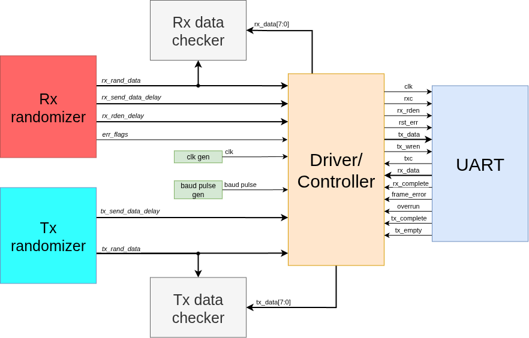

# Симуляция в testbench

Для проверки работоспобности написан тестовый проект. Testbench состоит из

* Блоков рандомизации данных, флагов и задержек
* Драйвера для взаимодействия с RTL UART
* Генераторов клоков `clk` и `baud_pulse`
* Блоков-компараторов отправленных и принятых данных

Структурная схема testbench:

{: style="height:250px" }

