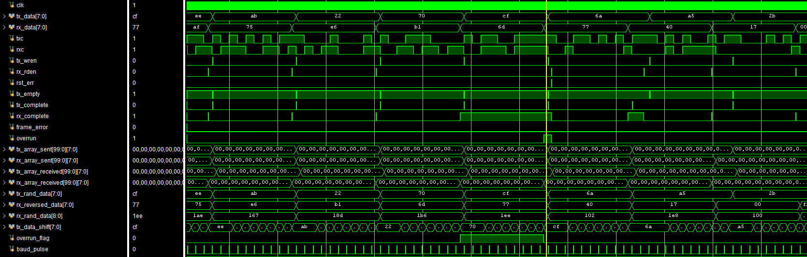

## Сравнение данных

Количество итераций приема/передачи данных (количество тестов) задается параметром `NUMBER_OF_TESTS` (по умолчанию = **100**). По достижении этого значения поддрайверами **tx_driver** и **rx_rdiver** производится проверка принятых в буферы данных. В случае несовпадения инкриментируется счетчик `err`. Если все данные совпадают, выводится сообщение '**Test succeed!**'. 

## Временная диаграмма

{: style="height:250px" }
/// caption
Рис. Временная диаграмма из Vivado
///
